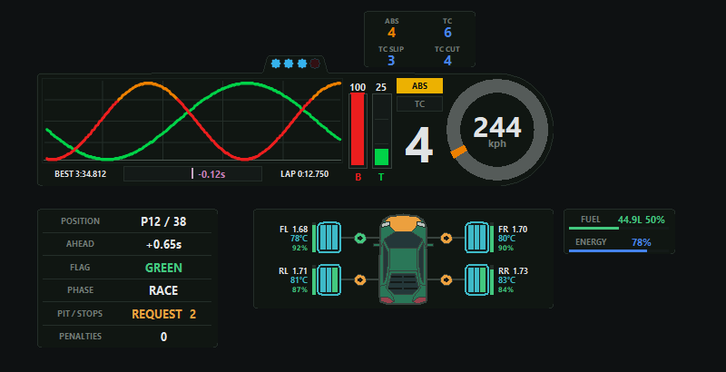

# ApexTrace VR

**Telemetry-HUD fuer Le Mans Ultimate**

[English instructions](README.md) | [Kompatibilitaet](COMPATIBILITY_DE.md) | [Bekannte Probleme](KNOWN_ISSUES_DE.md) | [Support](SUPPORT.md)

> Oeffentliche Beta-Software. Lies vor Online-Sitzungen die Beta-Einschraenkungen.

### [ApexTrace VR 0.2.0-beta.60 Installer herunterladen](https://github.com/fabiogstohl/ApexTrace-VR-Releases/releases/download/v0.2.0-beta.60/ApexTrace-VR-v0.2.0-beta.60-setup.exe)

[Alle Release-Dateien und Pruefsummen anzeigen](https://github.com/fabiogstohl/ApexTrace-VR-Releases/releases)

Die Vorschau verwendet simulierte Telemetrie. Gepruefte LMU- und OpenXR-Kombinationen
stehen auf der [Kompatibilitaetsseite](COMPATIBILITY_DE.md). Die
[30-sekuendige animierte HUD-Vorschau](media/hud-demo.webp) zeigt die laufenden
Uebergaenge.

## Download

Lade den [aktuellen Windows-Installer](https://github.com/fabiogstohl/ApexTrace-VR-Releases/releases/download/v0.2.0-beta.60/ApexTrace-VR-v0.2.0-beta.60-setup.exe) herunter. Dies ist der
normale Installer fuer den aktuellen Windows-Benutzer und benoetigt keine Administratorrechte.
Aeltere Versionen und Pruefsummen bleiben auf der
[Release-Seite](https://github.com/fabiogstohl/ApexTrace-VR-Releases/releases) verfuegbar.

Das portable `windows-x64.zip` bleibt fuer fortgeschrittene Nutzung verfuegbar.
Verwende nicht die automatisch von GitHub erzeugten `Source code`-Archive; sie
enthalten die Anwendung nicht. Installer und ZIP haben jeweils eine passende
`.sha256`-Datei.

## Anzeigen

- Brems- und Gasverlauf mit aktuellem Brems-Peak
- Lenkrichtung und aktuelle Geschwindigkeit
- Gelbe Geschwindigkeitsanzeige bei aktivem Boxengassen-Limiter
- Gang, ABS und Traktionskontrolle
- Kraftstoffstand und Hybridenergie bei unterstuetzten Hypercars
- Eigene HUDs fuer Warnungen und Aenderungen an ABS/TC
- Progressive Drehzahlleuchten und Schaltblitz
- Delta zur besten Runde mit einstellbarem Bereich, Bestzeit und laufender Rundenzeit
- Rennposition und Fahrerzahl, Abstand nach vorn, Flagge, Rennphase und Startampel
- Boxenanforderung und -status, absolvierte Stopps und offene Strafen
- Drei Oberflaechentemperaturen, Karkassentemperatur, Druck und Restlebensdauer je Reifen
- Bremsentemperatur sowie Warnungen fuer Plattfuss und verlorene Raeder
- Acht Karosserie-Schadenszonen sowie Warnungen fuer verlorene Teile und Ueberhitzung
- Kompakte LMU-aehnliche Fahrzeugansicht mit farbcodierten Reifen, Bremsen, Verschleiss und Schaeden
- Englische und deutsche Texte im Einstellfenster

Das HUD funktioniert als Desktop-Overlay und als native OpenXR-Composition-Layer in
VR. Der VR-Modus verwendet die bereits von LMU genutzte OpenXR-Laufzeit und stellt die
System-Laufzeit nicht um.

Oben rechts kann direkt zwischen `DESKTOP` und `OPENXR` gewechselt werden. ApexTrace
speichert die Auswahl, aktualisiert den Windows-Autostart und startet im gewaehlten
Modus neu.

Unter **Einheiten** wird die Geschwindigkeitseinheit gewaehlt. **Pedale & Lenkrad**
schaltet gemeinsam zwischen direkten und gefilterten LMU-Eingangssignalen um. Die
globale Transparenz und Rendergroesse befinden sich unter **Anwendung**. Dort liegen auch
die **Taste fuer Position setzen**, **Overlay beenden**, bestaetigungspflichtige
Reset-Aktionen und die vollstaendige Deinstallation. Mit **HUD-Vorschau** werden alle HUDs
mit animierter simulierter Telemetrie auf dem Desktop geoeffnet. Dafuer wird eine
temporaere Konfiguration verwendet; Ausgabemodus und gespeicherte Anordnung bleiben
unveraendert. **Anwendung zuruecksetzen** setzt alle ApexTrace-Einstellungen und
HUD-Anordnungen zurueck, behaelt aber die Bestzeiten. **Bestzeiten loeschen** entfernt nur
diese Liste. Einstellungen, die nur ein HUD betreffen, bleiben auf der Seite des jeweiligen
Moduls. Jede Aenderung wird automatisch gespeichert.
**Bestzeiten** speichert fuer jede Strecke die schnellste gueltige LMU-Runde zusammen
mit dem verwendeten Fahrzeug. Die lokale Liste bleibt nach Sitzungs- und App-Neustarts erhalten.

Fahr-HUD, Startampel, vertikale Rennliste, Fahrzeugstatus, Kraftstoff/Energie,
Warnungen und ABS/TC-Aenderungen sind getrennte Module. **HUD-Anordnung** in der linken
Navigation aufklappen, um jedes Modul auszuwaehlen oder ein-/auszuschalten. In VR kann es
danach einzeln verschoben, skaliert und transparent eingestellt werden. Im
Desktop-Modus zuerst Durchklicken deaktivieren und danach jedes Modul direkt mit der
Maus verschieben.
Im OpenXR-Modus besitzt jedes Modul zusaetzlich eine eigene Entfernung sowie Neigung,
Drehung und Rollwinkel.
Bei neuen Installationen sind nur Fahr-HUD und Fahrzeugstatus aktiv. Alle weiteren
Module koennen mit den Schaltern unter **HUD-Anordnung** eingeschaltet werden.

### LMU und HUD geradeaus zentrieren

ApexTrace bereitet beim ersten Start mit geschlossenem LMU eine freie LMU-Tastaturtaste
zum Zentrieren vor. Bestehende Tastatur- und Lenkradbelegungen bleiben erhalten. Im
Desktop-Einstellfenster oben mittig **Position setzen** waehlen. Warten, bis LMU und
HUD geradeaus zentriert sind.

Fuer die Bedienung aus dem Cockpit unter **Anwendung -> Taste fuer Position setzen**
**Belegen** waehlen und danach eine Tastatur- oder Lenkradtaste druecken. **Loeschen**
entfernt die Belegung. Die Taste fuehrt dieselbe gemeinsame Zentrierung nur aus, wenn LMU
im Vordergrund ist, der Fahrer im Auto sitzt und die OpenXR-Sitzung bereit ist. Lenkradtasten
werden nicht exklusiv ueber DirectInput gelesen und bleiben fuer LMU verfuegbar.

Dieser eine Befehl zentriert zuerst LMU und uebernimmt dieselbe OpenXR-Ausrichtung fuer
das HUD. Damit verwenden beide dieselbe Geradeausrichtung des Fahrers. Nach einem
LMU-Neustart oder bei einer neuen Fahrerposition den Befehl erneut ausfuehren. Die
erfasste Ausrichtung gilt nur fuer die aktuelle OpenXR-Sitzung.

## Voraussetzungen

- Windows 10 oder Windows 11, 64 Bit
- Le Mans Ultimate mit aktivierten Shared-Memory-Plugins
- Fuer VR: funktionierende 64-Bit-OpenXR-Laufzeit und eine D3D11-VR-Sitzung von LMU

## Installation

1. LMU beenden.
2. `ApexTrace-VR-...-setup.exe` starten und die Installation abschliessen. Sie gilt
   nur fuer den aktuellen Windows-Benutzer. Im Installer ist sichtbar waehlbar, ob der
   ApexTrace-Hintergrunddienst mit Windows startet.
3. In LMU `Settings -> Gameplay -> Enable Plugins` aktivieren.
4. Meta Quest Link, Steam Link oder SteamVR wie gewohnt starten und danach LMU normal
   starten.
5. Ins Auto gehen. ApexTrace VR oeffnet die Einstellungen auf dem Desktop und zeigt
   das HUD im aktiven Ausgabemodus.

Das Setup installiert die OpenXR-API-Layer fuer den aktuellen Windows-Benutzer und
aktiviert den Hintergrunddienst nur, wenn diese Installer-Option ausgewaehlt ist. Beides
kann spaeter im Einstellfenster geaendert werden. Vorhandene HUD-Einstellungen und die
aktuelle Autostart-Auswahl bleiben bei Updates erhalten.

Die Seiten **Status** und **Diagnose** pruefen die LMU-Einstellung fuer die
VR-Menue-Hintergrundanimation. Falls der Schutz gegen Menueflackern nicht aktiv ist,
kann **Menueflackern beheben** nach einer Bestaetigung genau diese Einstellung
deaktivieren. LMU vorher beenden; ApexTrace erstellt vor der Aenderung eine datierte
Sicherung der `Settings.JSON`.

Falls bei Quest Link trotzdem schwarze Wellen am Rand des LMU-VR-Menues erscheinen,
bieten **Status** und **Diagnose** die ausdruecklichen Aktionen **Meta ASW deaktivieren**
und **Automatik wiederherstellen**. Sie betreffen nur die aktuelle Meta-Link-Sitzung,
benoetigen ein laufendes LMU und aendern die ausgewaehlte OpenXR-Runtime nicht.

## Aktualisierung

Das Einstellfenster prueft nach dem Start GitHub Releases und bietet zusaetzlich
**Nach Updates suchen**. Wenn eine neue Version verfuegbar ist, mit **GitHub-Release
oeffnen** die offizielle Release-Seite aufrufen und den Installer dort manuell
herunterladen. ApexTrace VR laedt oder installiert Updates niemals automatisch.

## Deinstallation

LMU beenden und unter **Anwendung** auf **ApexTrace VR deinstallieren** klicken oder
**ApexTrace VR** in den Windows-**Installierten Apps** entfernen. Nach der Bestaetigung
entfernt der Uninstaller OpenXR-Layer, Windows-Autostart, Konfiguration, Diagnosedaten und
Bestzeiten. Er stellt nur die von ApexTrace geaenderten Werte fuer LMU-Menueanimation und
Zentrierungsbelegung wieder her; andere LMU-Einstellungen und Belegungen bleiben erhalten.

Bei einer portablen Installation unter **Diagnose** die **OpenXR-Layer
deinstallieren**, den Windows-Autostart deaktivieren, ApexTrace VR beenden und danach
den portablen Ordner loeschen.

Wenn LMU nach einem OpenXR- oder LMU-Update das Menue nicht mehr erreicht, im
Windows-Startmenue **ApexTrace VR - OpenXR-Layer deaktivieren (Wiederherstellung)**
ausfuehren. Dadurch wird nur der VR-Layer abgeschaltet; Einstellungen und Bestzeiten
bleiben erhalten. LMU danach vollstaendig neu starten.

## Beta-Einschraenkungen

- Die aktuelle Beta kann unsigniert sein; Windows SmartScreen kann deshalb warnen.
- Online- und Easy-Anti-Cheat-Kompatibilitaet muss fuer jeden Release erneut geprueft
  werden.
- Nicht in den Testhinweisen genannte Headset-/Runtime-Kombinationen sind ungeprueft.
- Bei Problemen unter **Diagnose** ein Support-Paket erzeugen. Vor dem Teilen pruefen,
  weil Diagnoseinformationen lokale Pfade und Systemdetails enthalten koennen.

Die vollstaendige Liste steht unter [Bekannte Probleme und Wiederherstellung](KNOWN_ISSUES_DE.md).

## Quellcode

Die Beta-Binaries sind unter der beigefuegten Binary-Lizenz kostenlos nutzbar. Der
Quellcode der Anwendung wird derzeit nicht veroeffentlicht. Drittanbieter-Komponenten
behalten ihre eigenen Lizenzen und Hinweise.

ApexTrace VR ist ein unabhaengiges, inoffizielles Tool und steht in keiner Verbindung
zu Studio 397, Motorsport Games, Le Mans Ultimate, Valve oder Meta.
